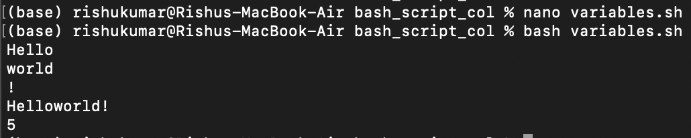
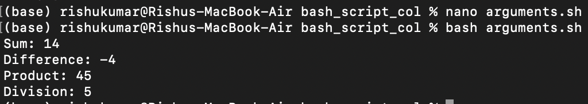
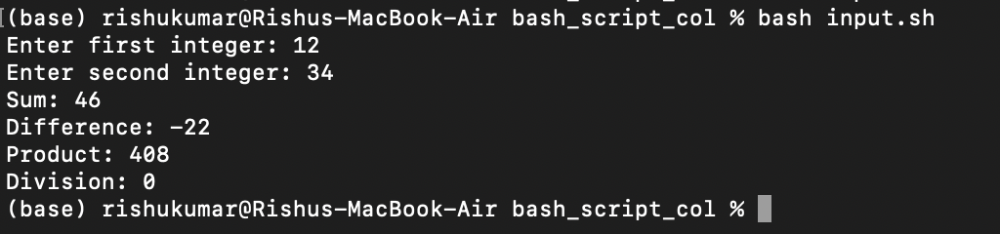
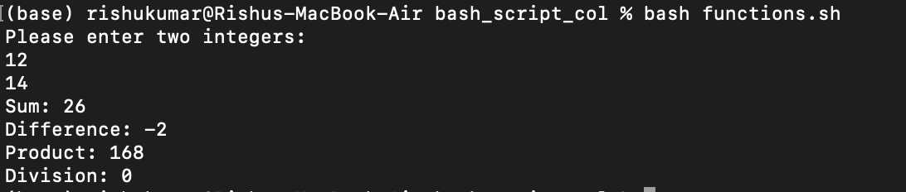
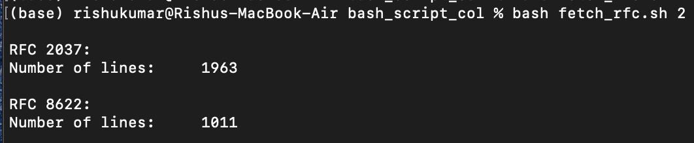

# Bash Scripting Showcase

This project contains 5 simple bash scripts that showcase different functionalities of Bash. The scripts are:

1. `variables.sh` - demonstrates the use of variables in Bash.
2. `command_line_arguments.sh` - shows how to take command-line arguments in Bash.
3. `interactive_input.sh` - demonstrates how to take input interactively and validate it.
4. `functions.sh` - shows how to create and use functions in Bash.
5. `fetch_rfc.sh` - fetches N random RFC files and prints their titles and number of lines.

### Each script is described in more detail below.

## 1. variables.sh

Run script using: `bash variables.sh`

This script demonstrates how to declare and use variables in Bash. It defines three static variables and prints them out. It then joins two of the variables together to create a new variable and calculates the sum of all three variables.

## 2. command_line_arguments.sh

Run script using: `bash command_line_arguments.sh`

This script demonstrates how to handle command line arguments in Bash. It takes two parameters as input and prints out the sum, difference, product, and division of the numbers.

## 3. interactive_input.sh

Run script using: `bash interactive_input.sh`

This script demonstrates how to accept user input interactively in Bash. It asks the user for two integers and tests if they are integers. If not, it prompts the user to try again. It then performs the same operations as the previous script, but with the user-provided integers.

## 4. functions.sh

Run script using: `bash functions.sh`

This script demonstrates how to define and use functions in Bash. It extracts the arithmetic operations from the previous two scripts into a function and places the function in an external file. It also combines scripts 2 and 3 so that the arguments can be given as parameters or read interactively.

## 5. fetch_rfc.sh

Run script using: `bash fetch_rfc.sh 2`

This script demonstrates how to use Bash to fetch random RFC files from the web and extract useful information from them. It takes a number as a command line argument and fetches that many random RFC files. For each file, it prints out the title of the RFC and the number of lines in the file.
